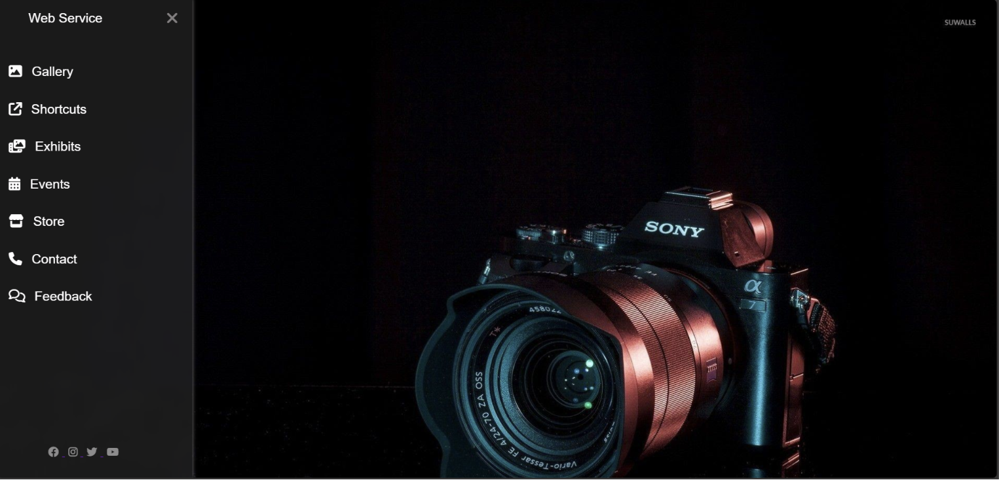

# 🚀 Responsive Sidebar Navigation Menu

A modern and interactive **Responsive Sidebar Navigation Menu** built using **HTML5, CSS3, and Font Awesome Icons**. This project features a smooth sliding sidebar with glassmorphism effects, hover animations, and a visually appealing UI design.

## ✨ Features

✔️ Responsive Sidebar Navigation  
✔️ Smooth Open/Close Animation  
✔️ Glassmorphism Sidebar Effect  
✔️ Font Awesome Icons Integration  
✔️ Hover Effects & Transitions  
✔️ Background Image Support  
✔️ Clean & Minimal UI Design  
✔️ Pure HTML & CSS (No JavaScript)

---

## 🛠️ Technologies Used

- **HTML5** → Structure & Content
- **CSS3** → Styling, Animation & Effects
- **Font Awesome** → Icons
- **Glassmorphism UI** → Modern Design Effect

---

## 📂 Project Structure

```bash
responsive-sidebar-menu/
│
├── index.html      # Main HTML file
├── style.css       # Styling file
├── photo.jpg/png   # Background image
└── README.md       # Project documentation
```

---

## 🎯 Project Preview

This project includes:

- Animated Sidebar Navigation
- Menu Icons with Hover Effects
- Smooth Sliding Transitions
- Transparent Blur Sidebar Design
- Responsive Layout

---

## 📸 Screenshots

Add screenshots of your project here:

```md

```

---

## ⚙️ Installation & Usage

1. Clone the repository:

```bash
git clone https://github.com/yourusername/responsive-sidebar-menu.git
```

2. Open project folder:

```bash
cd responsive-sidebar-menu
```

3. Run:

Open `index.html` using **Live Server** in VS Code.

---

## 💡 Learning Outcomes

Through this project, concepts practiced include:

- HTML Structure
- CSS Positioning
- Transitions & Animations
- Flexbox Basics
- Responsive Design
- Sidebar Navigation UI
- Font Awesome Integration
- Glassmorphism Effects

---

## 🔮 Future Improvements

- Add Dark/Light Mode
- Improve Mobile Responsiveness
- Add JavaScript Interactivity
- Add Dropdown Menus
- Include More Animations

---

## 👨‍💻 Author

**Srujan V**

Passionate about **Web Development, AI, MERN Stack, and Building Modern UI Projects**

GitHub:
https://github.com/yourusername

LinkedIn:
(Add LinkedIn Profile)

---

## ⭐ Support

If you like this project, consider giving it a **Star ⭐** on GitHub!

---

### Built with ❤️ using HTML, CSS & Creativity